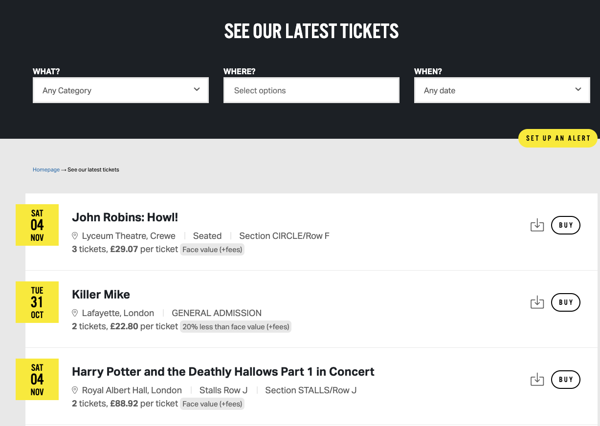
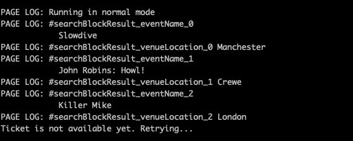

# norah - A Twickets Crawler

A simple node app I made to search for Norah Jones tickets for my partner (😷). Reading online it seems that Twickets' own alert system is slightly delayed and highly contended by various other fans desperate to get face-value tickets, your best bet is to constantly refresh the feed. 

**norah.js** will crawl over the top 3 elements in the Twickets feed every 10 seconds

## Usage

Clone this repository.

`cd` into the root directory and then...

```
npm install
```
Edit `norah.js` constants to fit your purposes, see `ARTIST` and `LOCATION`, also edit the email information in `sendEmail()`.
Create a `.env` in the root directory and add your personal Google App Password as `NODEMAILER_GOOGLE_PASSWORD`. For more information see [here](https://www.educative.io/answers/how-to-use-nodemailer)

Once ready run...
```
node
```
In the node REPL run...
```
>.load norah.js
```
Leave it running in the background and await an email with subject **Ticket Available**.

Take that normies! 🤓

Feed:



Logs:

